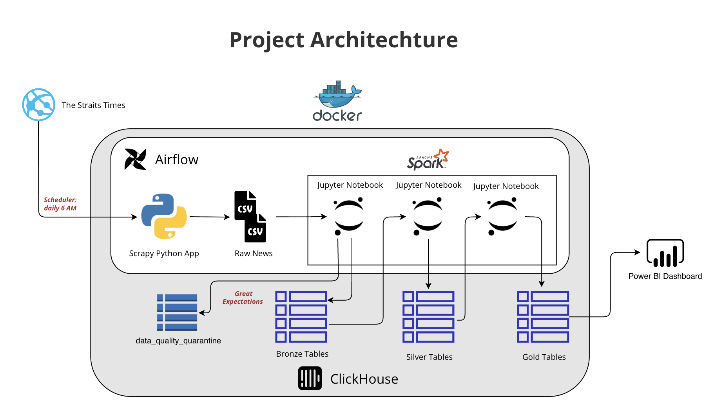
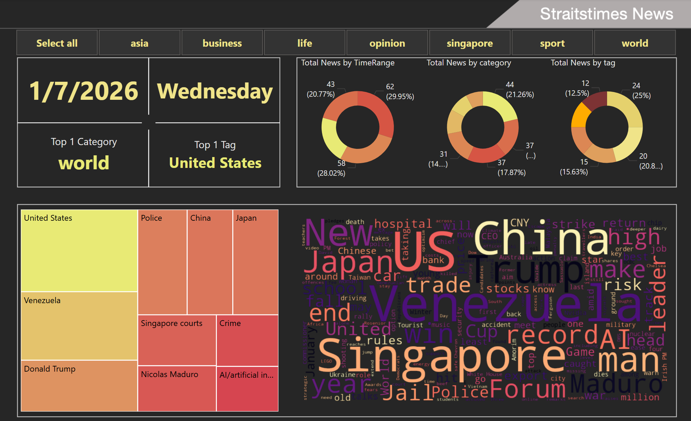

# News ELT Pipeline Project

A production-ready ELT (Extract, Load, Transform) pipeline for scraping, processing, and analyzing news articles from Straits Times using Apache Airflow, PySpark, and ClickHouse.

## Table of Contents

- [Architecture Overview](#architecture-overview)
- [Data Flow](#data-flow)
- [Technology Stack](#technology-stack)
- [Project Structure](#project-structure)
- [Database Schema](#database-schema)
- [Key Features](#key-features)
- [Airflow DAG](#airflow-dag)
- [Setup & Deployment](#setup--deployment)
- [Data Processing Details](#data-processing-details)
- [Monitoring & Maintenance](#monitoring--maintenance)
- [License](#license)

## Architecture Overview

This project implements a **medallion architecture** (Bronze → Silver → Gold) for data processing, orchestrated by Apache Airflow with automated data quality validation.




## Data Flow

### 1. **Extraction Layer** (`include/scrapy.ipynb`)
- **Technology**: BeautifulSoup4, Selenium, Requests
- **Process**: Scrapes news articles from Straits Times website
- **Output**: CSV files stored in `include/data/` directory
- **Fields**: title, publish_date, update_date, img_url, caption_text, tags_list, full_article, url

### 2. **Bronze Layer** (`include/pyspark/bronze.py`)
- **Technology**: PySpark Streaming, Great Expectations
- **Process**:
  - Reads CSV files using Spark Structured Streaming
  - Validates data quality using Great Expectations (GX) suite
  - Implements row-level validation with automatic quarantine for failed records
  - Writes validated data to ClickHouse `straitstimes_news_bz` table
- **Features**:
  - Incremental processing with checkpoint management
  - Data quality validation with `straitstimes_news_bz_suite` expectations
  - Failed records quarantined to `data_quality_quarantine` table
  - Adds `load_time` timestamp for tracking

### 3. **Silver Layer** (`include/pyspark/silver.py`)
- **Technology**: PySpark, ClickHouse ReplacingMergeTree
- **Process**:
  - Incremental batch processing using watermark (`load_time`)
  - Data cleaning: deduplication, null handling, type conversion
  - Converts string dates to DateTime format
  - Writes to `straitstimes_news_sl` table with `update_time` tracking
- **Transformations**:
  - Date parsing: `MMM dd, yyyy, hh:mm a` → DateTime
  - Null value handling (strings → 'Unknown', numeric → 0)
  - Duplicate removal
  - All-null row filtering

### 4. **Gold Layer** (`include/pyspark/gold.py`)
- **Technology**: PySpark, Dimensional Modeling
- **Process**:
  - Incremental processing using `update_time` watermark
  - Creates dimensional model:
    - **Fact Table** (`fact_news_gl`): News articles with date/time keys
    - **Dimension Table** (`dim_tags_gl`): Normalized tags (one row per tag per article)
- **Transformations**:
  - Date extraction: DateTime → Date (yyyy-MM-dd)
  - Time key extraction: HH:mm format
  - Tag normalization: Array explosion from comma-separated list
  - Tag cleaning: Removes brackets and quotes

## Technology Stack

### Core Technologies
- **Apache Airflow** (Astronomer Runtime 12.6.0): Workflow orchestration
- **PySpark 3.5.0**: Distributed data processing
- **ClickHouse**: Columnar OLAP database for analytics
- **Great Expectations 1.10.0**: Data quality validation framework

### Supporting Tools
- **Papermill**: Notebook execution engine for Airflow
- **ClickHouse Connect**: Native Python client for ClickHouse
- **BeautifulSoup4/Selenium**: Web scraping
- **Pendulum**: Timezone-aware datetime handling

## Project Structure

```
airflow-01-news-project/
├── dags/
│   └── news_elt_dag.py          # Airflow DAG definition
├── include/
│   ├── data/                     # Raw CSV files from scraper
│   ├── checkpoints/              # Spark Streaming checkpoints
│   ├── scrapy.ipynb              # Web scraping notebook
│   └── pyspark/
│       ├── bronze.py             # Bronze layer processing
│       ├── silver.py             # Silver layer processing
│       ├── gold.py               # Gold layer processing
│       ├── pyspark_common.py     # ClickHouse connection manager
│       ├── setup.py              # Database setup & preprocessing
│       ├── great_expectations_common.py  # GX validation logic
│       ├── run.ipynb             # Main ETL execution notebook
│       └── gx_configs/
│           └── expectations/     # Great Expectations suites
├── Dockerfile                    # Airflow container configuration
├── requirements.txt              # Python dependencies
└── airflow_settings.yaml         # Airflow local configuration
```

## Database Schema

### Bronze Layer (`straitstimes_news_bz`)
- **Engine**: MergeTree
- **Order**: url
- **Fields**: Raw data as strings with `load_time` timestamp

### Silver Layer (`straitstimes_news_sl`)
- **Engine**: ReplacingMergeTree(load_time)
- **Order**: url
- **Fields**: Cleaned data with DateTime types and `update_time`

### Gold Layer
- **`fact_news_gl`**: Fact table with Date and timekey fields
- **`dim_tags_gl`**: Dimension table for tags (url, tag, update_time)

### Data Quality
- **`data_quality_quarantine`**: Stores failed validation records with violation details

## Key Features

### 1. **Automated Data Quality**
- Row-level validation using Great Expectations
- Automatic quarantine of failed records
- Configurable expectation suites per table

### 2. **Incremental Processing**
- Watermark-based incremental loads at Silver and Gold layers
- Efficient processing of only new/changed data
- Checkpoint management for fault tolerance

### 3. **Scalable Architecture**
- Spark Streaming for real-time ingestion
- Distributed processing with PySpark
- Columnar storage with ClickHouse for analytics

### 4. **Production-Ready**
- Error handling and retry logic
- Timeout management (10 minutes for scraper)
- Comprehensive logging and monitoring

## Airflow DAG

The `notebook_etl_pipeline` DAG runs daily at 6:00 AM (Asia/Shanghai timezone):
1. **run_scrapy_notebook**: Executes web scraping notebook
2. **run_spark_etl_notebook**: Executes Spark ETL pipeline (Bronze → Silver → Gold)

## Setup & Deployment

### Prerequisites
- Docker & Docker Compose
- Astronomer CLI (for local development)
- ClickHouse instance (configured in `pyspark_common.py`)

### Local Development
```bash
# Start Airflow locally
astro dev start

# Access Airflow UI
# http://localhost:8080
```

### Configuration
- Database connection: Configure in `pyspark_common.py` (default: localhost:8123)
- Airflow settings: Edit `airflow_settings.yaml` for connections/variables
- Dependencies: Install from `requirements.txt`

## Data Processing Details

### Bronze Layer Processing
- **Streaming Mode**: AvailableNow trigger (batch processing)
- **Checkpoint**: Stored in `include/checkpoints/straitstimes_news_bz/`
- **Validation**: Each micro-batch validated before insertion
- **Quarantine**: Failed rows stored with violation details

### Silver Layer Processing
- **Mode**: Incremental batch processing
- **Watermark**: `max(load_time)` from Silver table
- **Preprocessing**: Deduplication, null handling, type conversion
- **Engine**: ReplacingMergeTree for automatic deduplication

### Gold Layer Processing
- **Mode**: Incremental batch processing
- **Watermark**: `max(update_time)` from Gold tables
- **Modeling**: Star schema (fact + dimension tables)
- **Tag Processing**: Explodes comma-separated tags into normalized rows

## Monitoring & Maintenance

- **Checkpoints**: Monitor `include/checkpoints/` for streaming state
- **Quarantine Table**: Review `data_quality_quarantine` for data quality issues
- **Airflow Logs**: Check task logs in Airflow UI for execution details
- **Great Expectations**: Validation results logged per batch

## License

[Add your license here]
